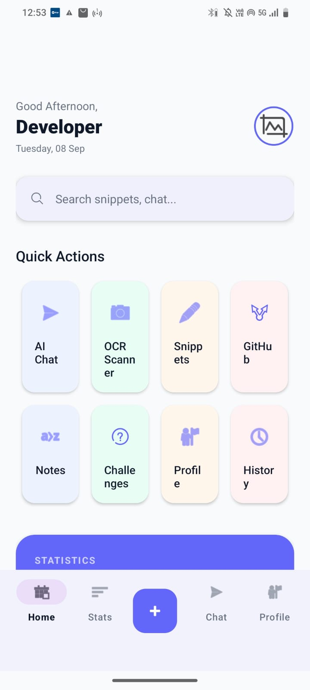
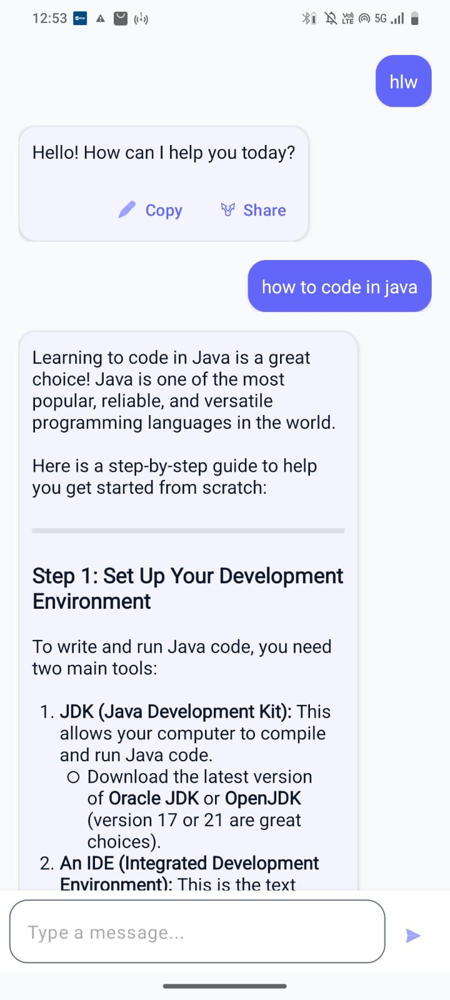
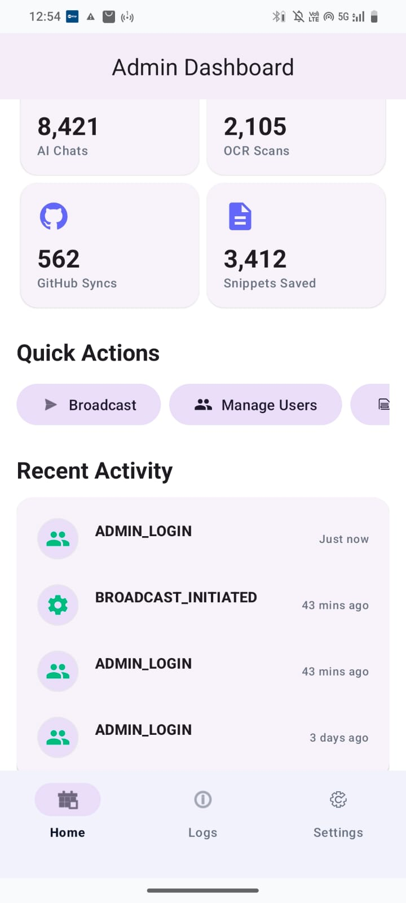
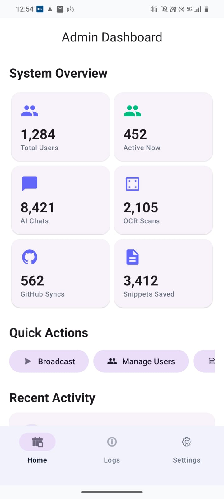
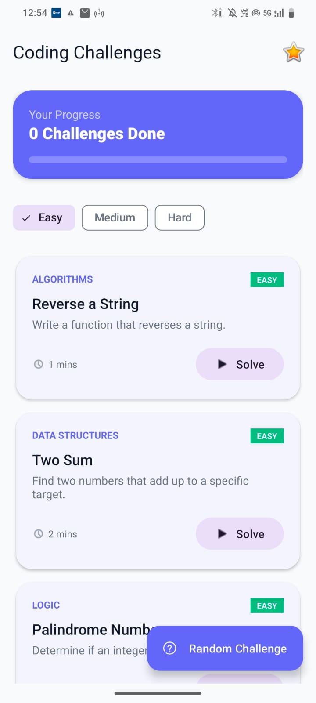

# 🚀 DevPilot AI

> An AI-powered Android developer companion designed to bring intelligent coding assistance, OCR, GitHub workflows, persistent conversations, and developer utilities into a single mobile application.

## 📱 Overview

DevPilot AI is an Android-based developer assistant that combines AI-powered assistance with practical developer tools.

The goal is to provide developers with a mobile workspace where they can interact with AI, analyze text through OCR, manage GitHub workflows, access previous conversations, and use developer-focused utilities without switching between multiple applications.

---

## ✨ Key Features

- 🤖 AI-powered developer chat
- 💬 Persistent chat history
- 📝 Markdown and code rendering
- 🔍 OCR-based text/code extraction
- 🐙 GitHub integration
- 🔐 Personal Access Token based GitHub authentication
- 🔥 Firebase Authentication
- ☁️ Firebase Firestore integration
- 💾 Room Database for local persistence
- 🎨 Light / Dark / System theme
- 👨‍💼 Admin Dashboard
- 📊 Developer-focused utilities
- 📤 Copy and share AI responses
- ⚡ Retrofit-based API communication

---

## 🛠️ Tech Stack

### Android Development

- Java
- Android Studio
- XML
- Material Design
- ConstraintLayout
- RecyclerView
- ViewModel
- LiveData

### AI & APIs

- Gemini API
- Retrofit
- Gson
- OkHttp

### Database & Backend

- Firebase Authentication
- Firebase Firestore
- Room Database

### Computer Vision

- Google ML Kit
- Text Recognition / OCR

### Developer Integration

- GitHub API
- Personal Access Token authentication

### UI & Libraries

- Material Components
- Glide
- Lottie
- Markwon
- Prism4j

---

## 📱 App Screenshots

### 🏠 Home Dashboard
The DevPilot AI home screen provides quick access to AI Chat, OCR Scanner, Code Snippets, GitHub, Notes, Coding Challenges, Profile, and History.

<p align="center">
  
</p>

---

### 🤖 AI Coding Assistant
An AI-powered coding assistant that helps developers understand programming concepts, learn technologies, and get coding guidance through natural-language conversations.

<p align="center">
  
</p>

---

### 🛠️ Admin Dashboard
A dedicated administration dashboard for monitoring application activity, managing users, viewing system statistics, and controlling platform-level operations.

<p align="center">
  
  
</p>

---

### 💻 Coding Challenges
An interactive coding practice module with Easy, Medium, and Hard challenges designed to help developers improve their problem-solving and DSA skills.

<p align="center">
  
</p>

---

## ✨ Key Highlights

- 🤖 AI-powered coding assistance
- 💬 Persistent AI chat and conversation history
- 📝 Code snippets management
- 📷 OCR-based text/code scanning
- 🐙 GitHub integration
- 💻 Interactive coding challenges
- 👨‍💼 Admin dashboard and system monitoring
- 📊 Developer statistics and progress tracking
- 🌙 Dark / Light / System theme support
- 🔐 User authentication
- ☁️ Firebase backend integration
- 📱 Modern Android UI
## 🏗️ Architecture

DevPilot AI follows a modular Android architecture based on separation of concerns.

```text
                    ┌──────────────────────┐
                    │      Android UI      │
                    │ Fragments / XML UI   │
                    └──────────┬───────────┘
                               │
                               ▼
                    ┌──────────────────────┐
                    │      ViewModel       │
                    │ Business Logic       │
                    └──────────┬───────────┘
                               │
                ┌──────────────┼──────────────┐
                ▼              ▼              ▼
        ┌─────────────┐ ┌─────────────┐ ┌─────────────┐
        │ Gemini API  │ │ Room DB     │ │ Firebase    │
        │ Retrofit    │ │ Local Data  │ │ Firestore   │
        └─────────────┘ └─────────────┘ └─────────────┘
                │
                ▼
        ┌─────────────────┐
        │ External APIs   │
        │ GitHub / ML Kit │
        └─────────────────┘